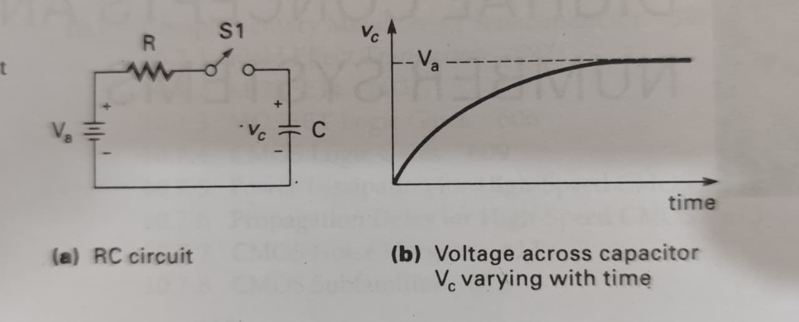

## Digital And Analog Basic Concept

# Analog 
The analog deals with a contionously signals that can take value.

Example :- Think of a car spedometer needle it move smooth the analog deals with smooth sine wave. 

