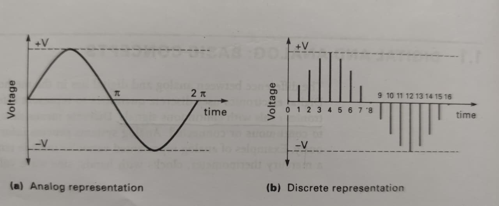

## Digital And Analog Basic Concept

# Analog System
The analog deals with a contionously signals that can take value.

Example :- Think of a car spedometer needle it move smooth the analog deals with smooth sine wave. 

# Digital System
The digital system use to discrit a value usially binary (0 & 1) it like a switch (ON & OFF)

0 - OFF

1 - ON

