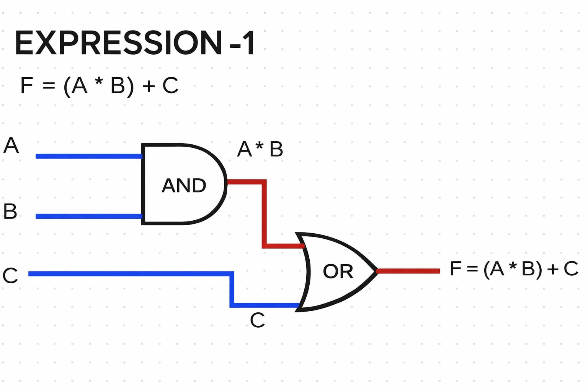
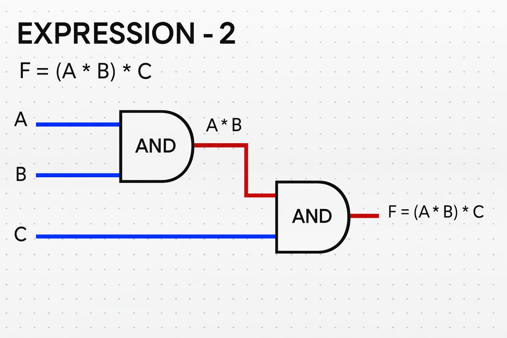
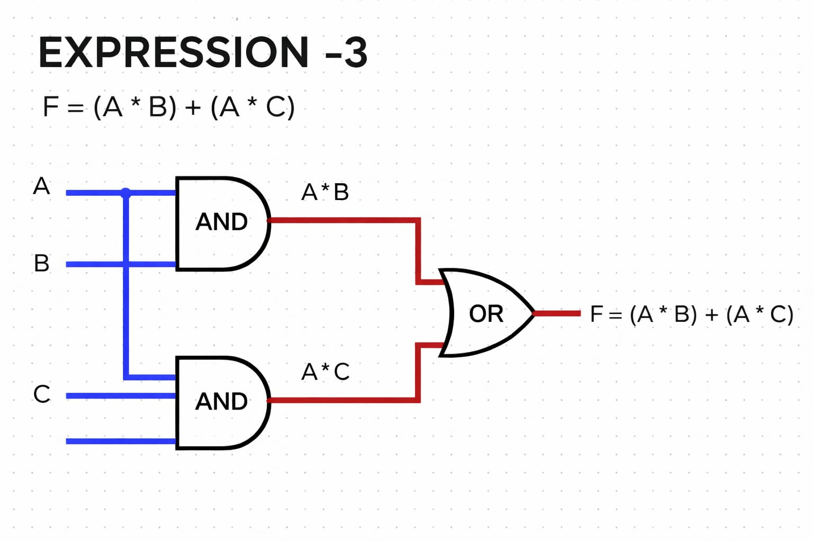
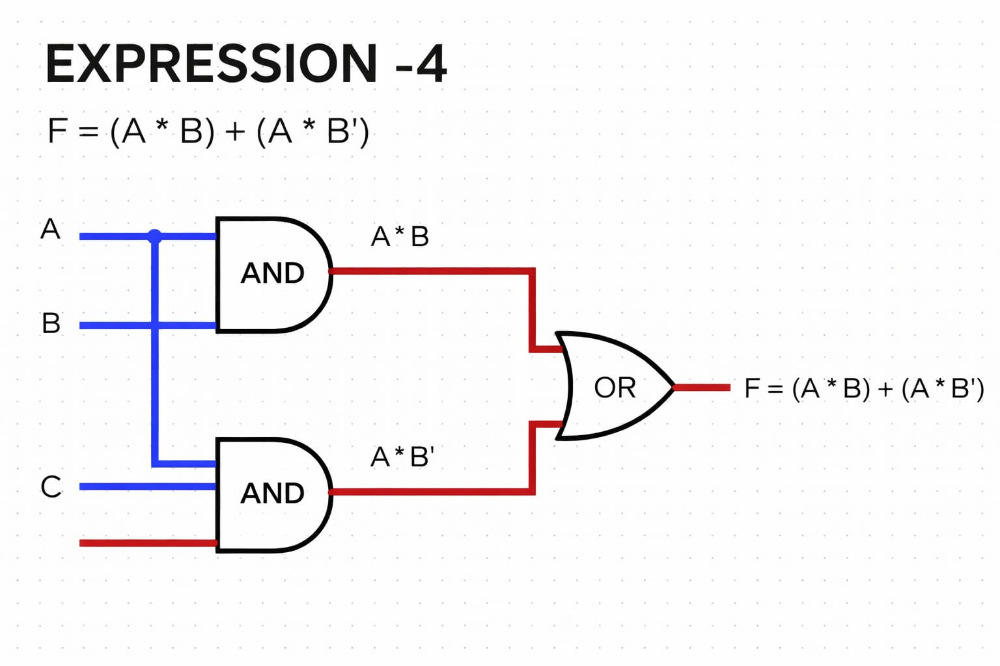
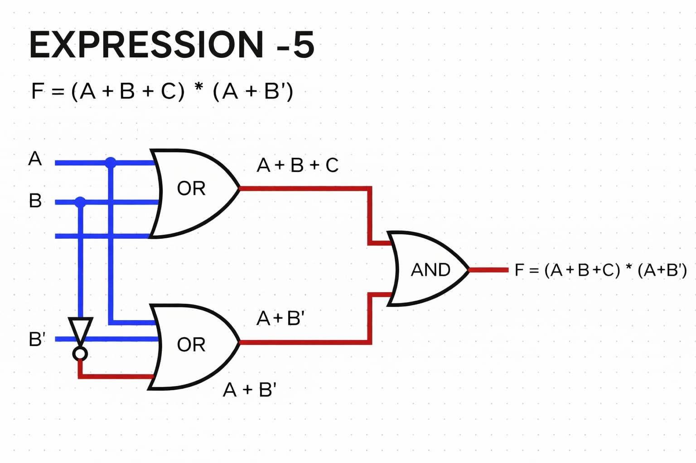
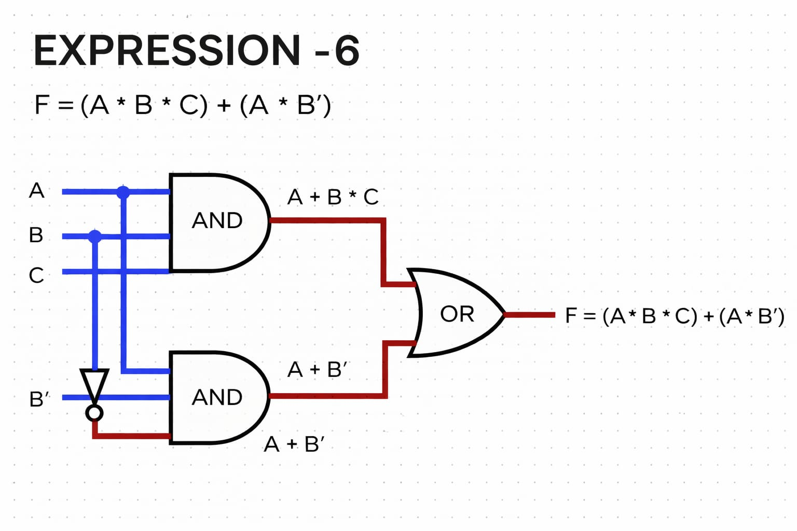

## Boolean Expression
Boolean expression represent logic relationship between variables using boolean operators.
These expression are used to design digital circuits.
_______________
# Problem - 1
*Expression*
F = (A * B) + C

## Circuit Diagram

_______________
# Problem - 2
*Expression*
F = (A * B) * C

## Circuit Diagram

_______________
# Problem - 3
*Expression*
F = (A * B) + (A * C)

## Circuit Diagram

_______________
# Problem - 4
*Expression*
F = (A * B) + (A * B')

## Circuit Diagram

_______________
# Problem - 5
*Expression*
F = (A + B + C) * (A + B')

## Circuit Diagram

_______________
# Problem - 6
*Expression*
F = (A * B * C) + (A * B')

## Circuit Diagram

