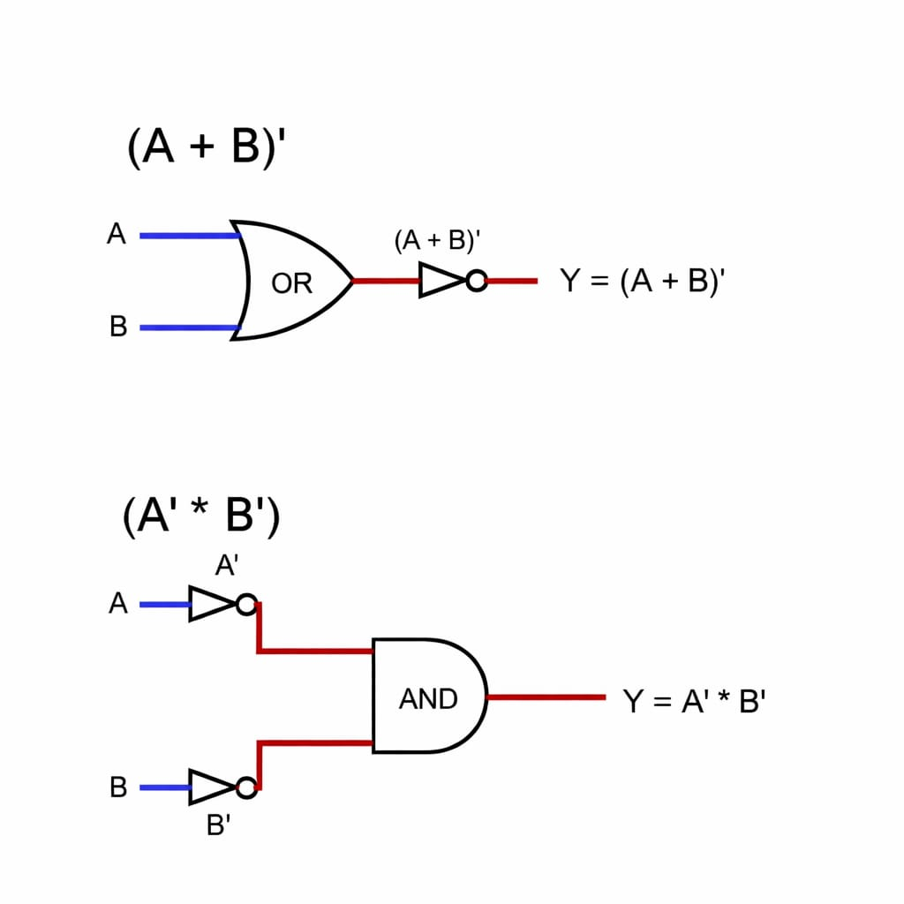
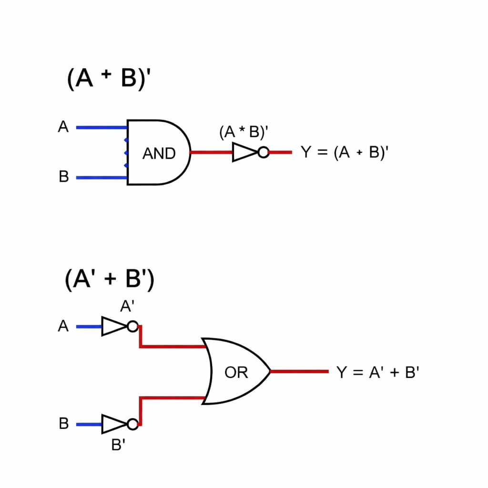

## De-morgans Theorem
The de-morgans theorem consist of teo fundamental rules in boolean algebra that is related to AND , OR , NOT operation.

They state that conplement of a product is the sum of complement [(A * B)' = (A' + B')].

And the complement of sum is the product of complement [(A + B)' = (A' * B')].

### Theorem:- 01
(A + B)' = (A' * B')

### Truth table
| A | B | A'| B'| A'*B'| A+B | (A+B)'|
|---|---|---|---|------|-----|-------|
| 0 | 0 | 1 | 1 |   1  |  1  |   1   |
| 0 | 1 | 1 | 0 |   0  |  1  |   0   |
| 1 | 0 | 0 | 1 |   0  |  1  |   0   |
| 1 | 1 | 0 | 0 |   0  |  1  |   0   |

--------------------------------------

### Theorem:- 02
(A * B)' = (A' + B')

