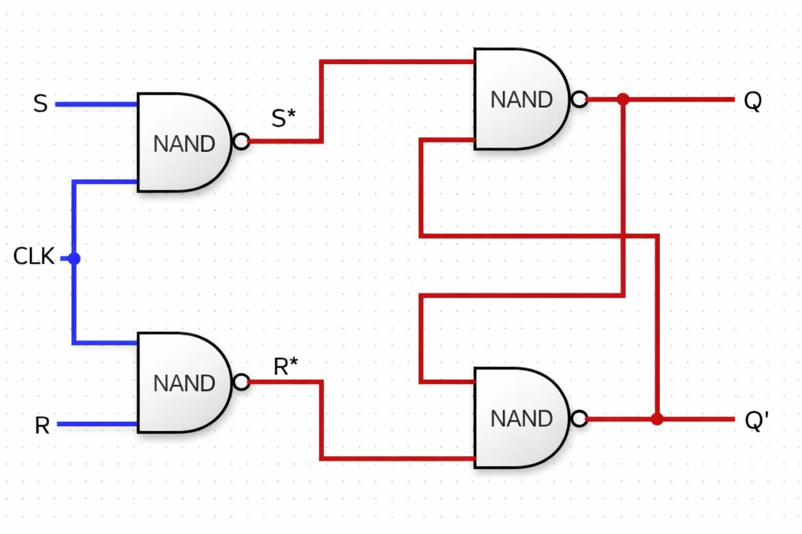

## SR Flip Flop
An SR(Set-Reset) flip-flop is a fundamental bistable multivibrator circuit used in digital electronics to store one single bit of data (o ot 1). It consists of two cross-coupled NOR or NAND gates, featuring S(Set) and R(Reset) input that allow it flip (set to 1 ) or flip (reset tp 0) its output Q

### Operation:
- Set
- Reset
- Hold
- Invalid

### logic Diagram

### Equation

- S* = (S.CLK)' = S' + CLK'
- R* = (R.CLK)' = R' + CLK'

### Truth Table

| S | R | Q | Q'|
|:-:|:-:|:-:|:-:|
| 0 | 0 | INVALID |INVALID |
| 0 | 1 | 1 | 0 |
| 1 | 0 | O | 1 |
| 1 | 1 | MEMORY | MEMORY |

| CLK | S | R | Q | Q'|
|:---:|:-:|:-:|:-:|:-:|
|  0  | - | - | MEMORY | MEMORY |
|  1  | 0 | 0 | MEMORY | MEMORY |
|  1  | 0 | 1 | 0 | 1 |
|  1  | 1 | 0 | 1 | 0 |
|  1  | 1 | 1 | INVALID | INVALID |
 
