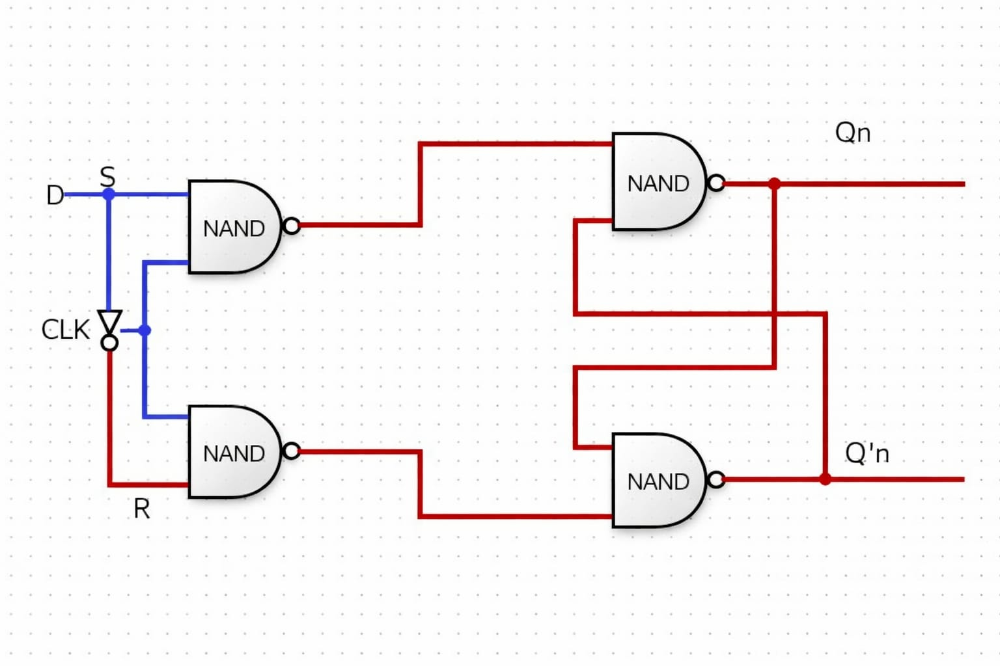

## D Flip Flop
A D flip-flop is stands for (Data flip flop) it is a fundamental digital electronics circuit that stores a single bit or data (0 or 1). it captures that D ata specfic edge of a clock signal and holds that value at the output Q until the next clock edge. 

### Key Feature 
- output Q
- input D

### Logic Diagram

### Truth Table

| CLK | S | R |   | Qn+1 |
|:---:|:-:|:-:|:-:|:----:|
|  0  | - | - |   |  QN  |
|  1  | 0 | 0 |   |  QN  |
|  1  | 0 | 1 |   |   1  |
|  1  | 1 | 0 |   |   1  |
|  1  | 1 | 1 |   | INVALID |
