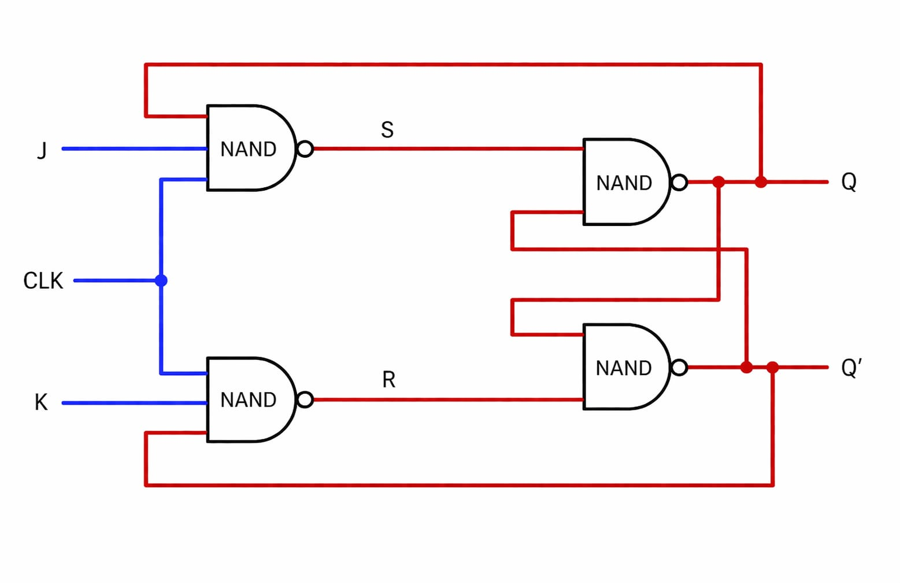

## JK Flip Flop
A JK flip flop is a versatile,clocked,bistable sequential logic circuit used to store 1 bit of data, acting as an improved version of the SR flip flop.

### Key Feature 
- Inputs = J (Set) and K(Reset) and clock signal (CLK)

- Outputs = Q and Q' 

### Logic Diagram 

### Truth Table 

| CLK | S | R |   | Qn+1 |
|:---:|:-:|:-:|:-:|:----:|
|  0  | - | - |   |  QN  |
|  1  | 0 | 0 |   |  Qn  |
|  1  | 0 | 1 |   |  0   |
|  1  | 1 | 0 |   |  1   | 
|  1  | 1 | 1 |   | INVALID |
