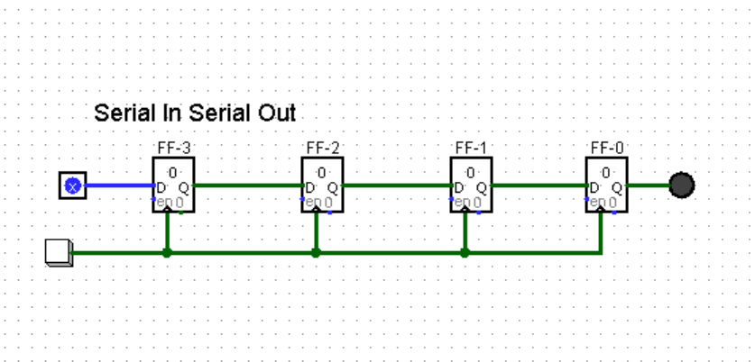

## SISO 
A Serial-in-Serial-Out register is a digital circuit that shifts bit-by-bit from a single input to a single output using a serial flip-flop (usually D-type) syncronized by a clock.

### 4-Bit SISO Example

In a 4-bit SISO register, input 
 is clocked through four consecutive D-flip-flops, with the output of 
 going to 
, and so on, with the final serial output taken from the 
 output of.

### SISO Circuit Diagram

### Truth Table 

|   CLK    |     | Q3 | Q2 | Q1 | Q0 |
|:--------:|:---:|:--:|:--:|:--:|:--:|
| Initally |     | 0  | 0  | 0  | 0  |
|          |     | 1  | 0  | 0  | 0  |
|          |     | 1  | 1  | 0  | 0  |
|          |     | 1  | 1  | 1  | 0  |
|          |     | 1  | 1  | 1  | 1  | 

