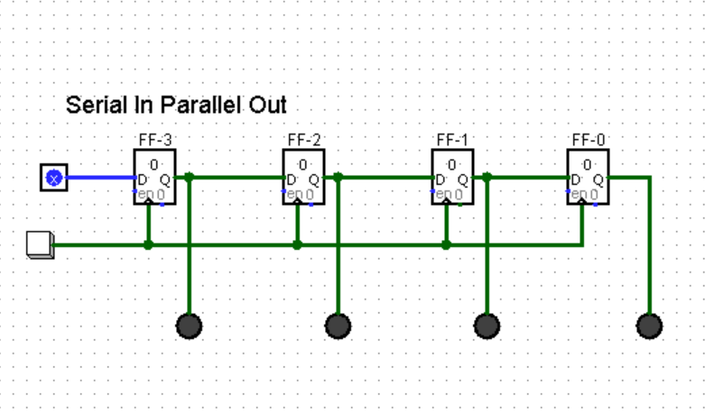

## SIPO
A Serial-in-Parallen-Out shift register is a digital circuit that converts serial data (input one bit ata time) into parallel data (outputs all bits simultaneously).

### Example: 4-Bit SIPO Shift Register

Imagine a 4-bit SIPO using 4 D-flip-flops (
 to 
) to receive data bits 1011 (leftmost bit last).

#### SIPO Circuit Diagram

### Truth Table 

