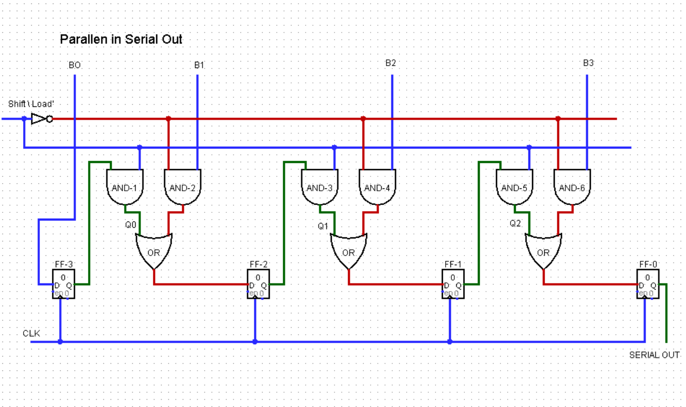

## PISO
A PISO (Parallel-In-Series-Out) register is a digital circuit tthat acceps multiple bits of data simeltaneously (parallel) and shift them out one by one (serial) over a single line.

### 4-Bit Example (Data '1010'):

Load Phase: The 4-bit word (
) is loaded into four flip-flops (Q0-Q3) at once.

### Logic Diagram

