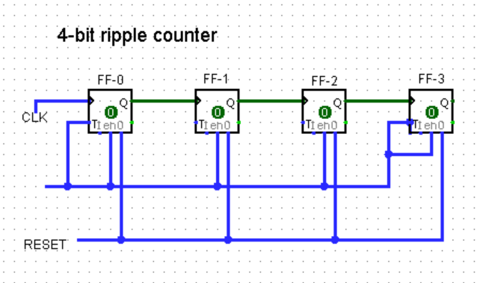

## Ripple Counter

A ripple counter ia a digital circuit where flip-flops are clocked sequentially,with the output of one acting as the clock for the next.

### Types of Ripple Counters

- Up Counter: Increments with each clock pulse.
- Down Counter: Decrements with each clock pulse.
- MOD-N Counter: A counter that divides the clock frequency by 
 (e.g., MOD-16 for a 4-bit counter).

### Important Points
- Negative edge triggered:- Q is clock [UP COUNTER]
- Positive edge triggered:- Q' is clock [UP COUNTER]
- Negative egde triggered:- Q' is clock [DOWN COUNTER]
- Positive edge triggered:- Q is clock [DOWN COUNTER]

### Circuit Diagram

### Truth Table

|  CLK  | QD | QC | QB | QA |
|:-----:|:--:|:--:|:--:|:--:|
|INITIAL| 0  | 0  | 0  | 0  |
|  1ST  | 0  | 0  | 0  | 1  |
|  2ND  | 0  | 0  | 1  | 0  |
|  3RD  | 0  | 0  | 1  | 1  |
|  4TH  | 0  | 1  | 0  | 0  |
|  5TH  | 0  | 1  | 0  | 1  |
|  6TH  | 0  | 1  | 1  | 0  |
|  7TH  | 0  | 1  | 1  | 1  |
|  8TH  | 1  | 0  | 0  | 0  |
|  9TH  | 1  | 0  | 0  | 1  |
| 10TH  | 1  | 0  | 1  | 1  |
| 11TH  | 1  | 0  | 1  | 1  |
| 12TH  | 1  | 1  | 0  | 0  |
| 13TH  | 1  | 1  | 0  | 1  |
| 14TH  | 1  | 1  | 1  | 0  |
| 15TH  | 1  | 1  | 1  | 1  |
