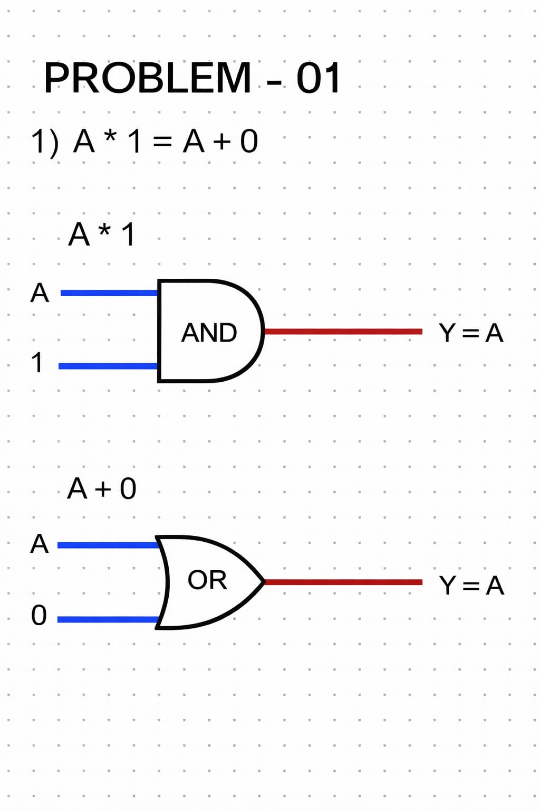
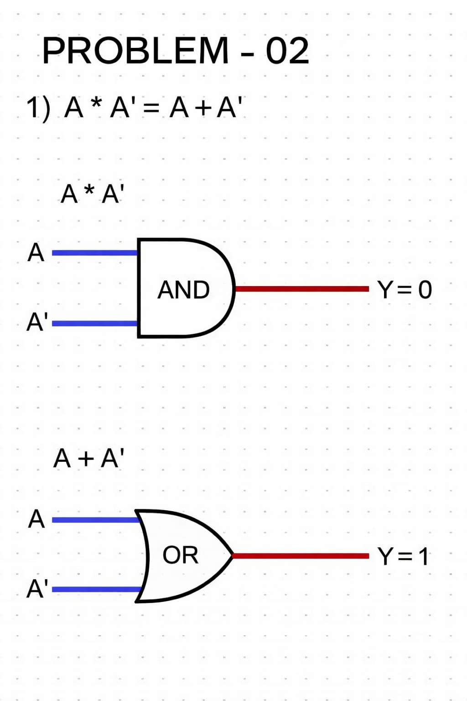
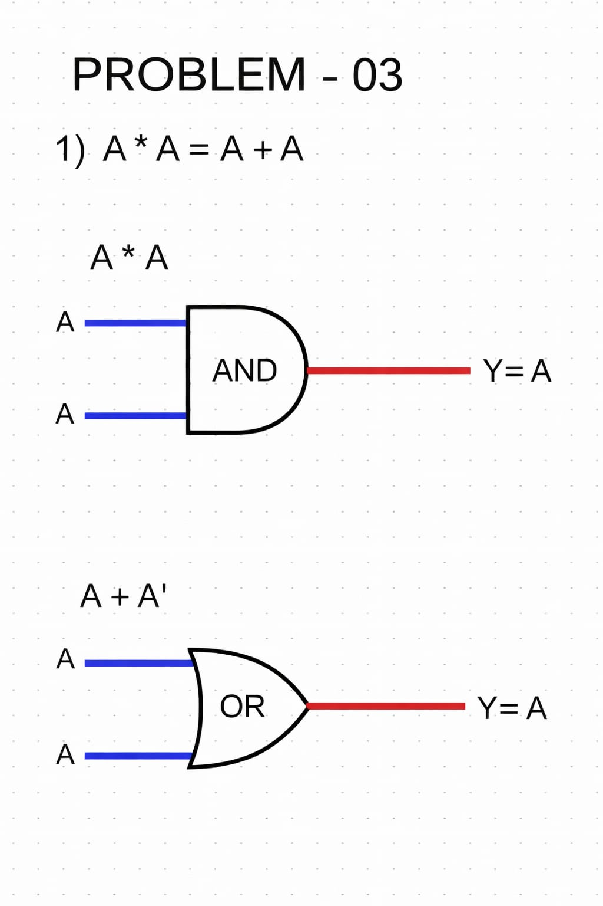
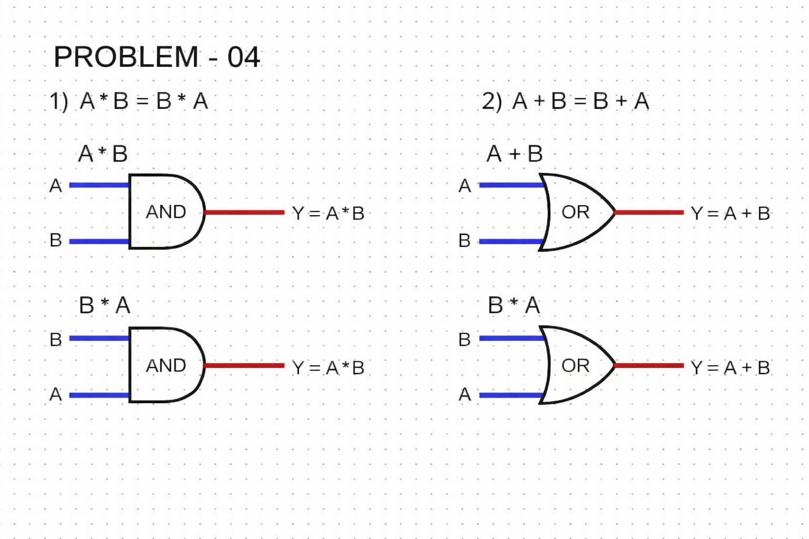
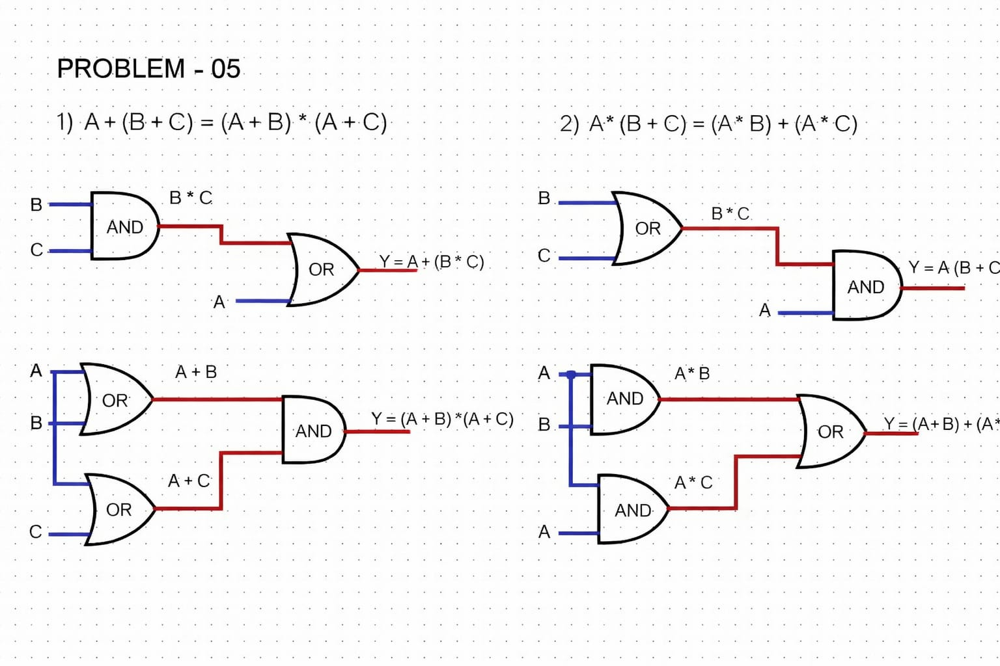
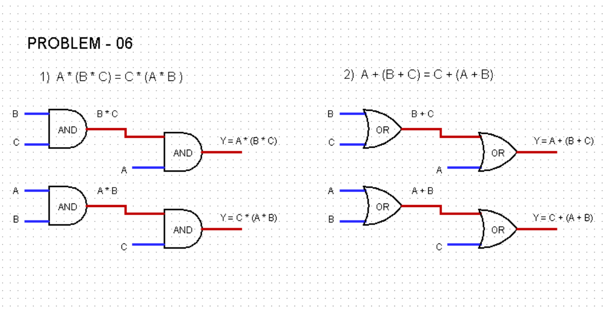

# Boolean Laws

Boolean laws are rules used to simplify Boolean expressions and design efficient digital circuits.

These laws help reduce the number of logic gates required in a circuit.
_______________
## Boolean Laws Table

|    Law           |    Expression    |
|     ----         |      ----        |
| Identity Law     | A·1 = A , A + 0 = A   |
| Complement Law   | A·A' = 0 , A + A' = 1   |
| Idempotent Law   | A·A = A , A + A = A  |
| Commutative Law  |  A·B = B·A , A + B = B + A |
| Distributive Law | A + (B + C) = (A + B) * (A + C)|
|                  | A * (B * C) = (A * B) + (A * C)|
| Associative Law  | A * (B * C) = c * (A * B)|
|                  | A + (B + C) = c + (A + B) |
_______________
# *Simplification*
## Identity Law
The identity law states that a variable remains unchanged when combined with identity elements.

## Problem on Identity Law - 01

1) A * 1 = A + 0

Expression:

A * 1 = A

Using Identity Law:

A * 1 = A

Also,

A + 0 = A

### Circuit Diagram

_______________
## Complement Law
The complement law states that a variable combined with its complement produces a constant value.

## Problem on Complement Law - 02

1) A * A' = A + A'

Expression:

A * A' = 0

Using Complement Law:

A * A' = 0

Also,

A + A' = 1

### Circuit Diagram

_______________
## Idempotent Law
The idempotent law states that repeating the same variable in an operation does not change its value.

## Problem on Idempotent Law - 03

1) A * A = A + A

Expression:

A * A

Using Idempotent Law:

A * A = A

Also,

A + A = A

### circuit Diagram

_______________
## commutative Law
The commutative law states that the order of variables does not affect the result of the operation.

## Problem on Commutative Law - 04

1) A * B = B * A
2) A + B = B + A

Expression:

A * B

Using Commutative Law:

A * B = B * A

Also,

A + B = B + A

### circuit Diagram

_______________
## Distributive Law
The distributive law states that multiplication distributes over addition and vice versa.

## Problem on Commutative Law - 05

1) A + (B + C) = (A + B) * (A + C)
2) A * (B * C) = (A * B) + (A * C)

Expression:

A + (B * C)

Using Distributive Law:

A + (B + C) = (A + B) * (A + C)
### circuit Diagram

_______________
## Associative Law
The associative law states that grouping of variables does not change the result of the operation.

## Problem on Associative Law - 06

1) A * (B * C) = c * (A * B)
2) A + (B + C) = c + (A + B)

Expression:

A * (B * C)

Using Distributive Law:

A + (B + C) = (A + B) * (A + C)
### circuit Diagram

_______________

pruutyuufhyruuyyuryuutyygyfyyuuryyrtgdfghsu

